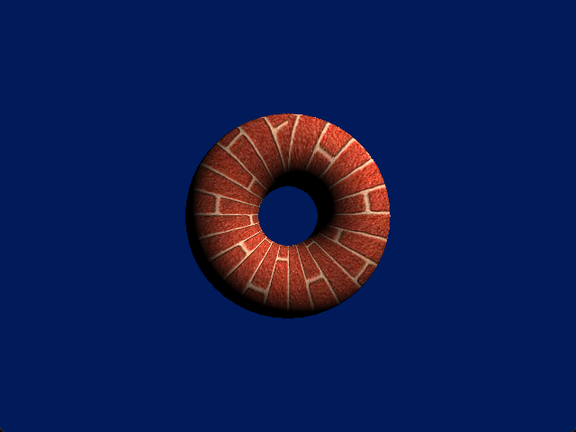
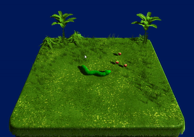
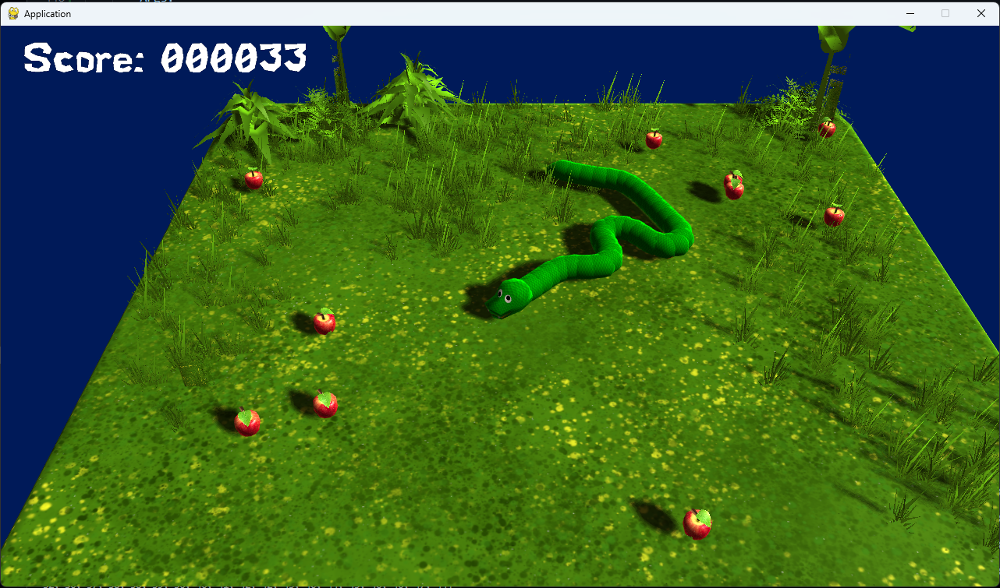

<div align="center" id="top"> 
  <!--  -->

  &#xa0;

  <!-- <a href="https://pyge.netlify.app">Demo</a> -->
</div>

<h1 align="center">PyGE</h1>

<p align="center">
  

  

  

  <!--  -->

  <!--  -->

  <!--  -->

  <!--  -->
</p>

<!-- Status -->

<h4 align="center"> 
	🚧  Pyge 🚀 Under construction...  🚧
</h4> 

<hr>

<p align="center">
  <a href="#dart-about">About</a> &#xa0; | &#xa0; 
  <a href="#sparkles-features">Features</a> &#xa0; | &#xa0;
  <a href="#rocket-technologies">Technologies</a> &#xa0; | &#xa0;
  <a href="#white_check_mark-requirements">Requirements</a> &#xa0; | &#xa0;
  <a href="#checkered_flag-starting">Starting</a> &#xa0; | &#xa0;
  <a href="#memo-license">License</a> &#xa0; | &#xa0;
  <a href="https://github.com/{{YOUR_GITHUB_USERNAME}}" target="_blank">Author</a>
</p>

<br>

## :dart: About ##

PyGE is a simple Python game engine built around pygame and PyOpenGL. It provides a simple Application adapter that you can use to build pygame and OpenGL applications.

<table>
  <tr>
    <td>
      
    </td>
    <td>
      
    </td>
  </tr>
  <tr>
    <td colspan="2" align="center">
      
    </td>
  </tr>
</table>

<!-- ## :sparkles: Features ##

:heavy_check_mark: Feature 1;\
:heavy_check_mark: Feature 2;\
:heavy_check_mark: Feature 3; -->

## :rocket: Technologies ##

The following tools were used in this project:

- [pygame](https://www.pygame.org/)
- [PyOpenGL](https://pyopengl.sourceforge.net/)
- [Pillow](https://python-pillow.org/)
- [numpy](https://numpy.org/)

## :white_check_mark: Requirements ##

Before starting, you need to have [Git](https://git-scm.com) and [Python 3.11.x or later](https://www.python.org/) installed.

## :checkered_flag: Starting ##

```bash
# Clone this project
$ git clone https://github.com/DCubix/pyge

# Access
$ cd pyge

# Create and activate a new virtual environment (you need the virtualenv package for this)
$ python -m venv env

# For Windows (powershell)
$ env/Scripts/activate.ps1

# For Linux
$ source env/Scripts/activate.sh && ./env/Scripts/activate.sh

# Install dependencies
$ pip install -r requirements.txt

# Run the project
$ cd src && python main.py
```

<!-- ## :memo: License ##

This project is under license from MIT. For more details, see the [LICENSE](LICENSE.md) file. -->

Made with :heart: by <a href="https://github.com/DCubix" target="_blank">Diego Lopes</a>

&#xa0;

<a href="#top">Back to top</a>
